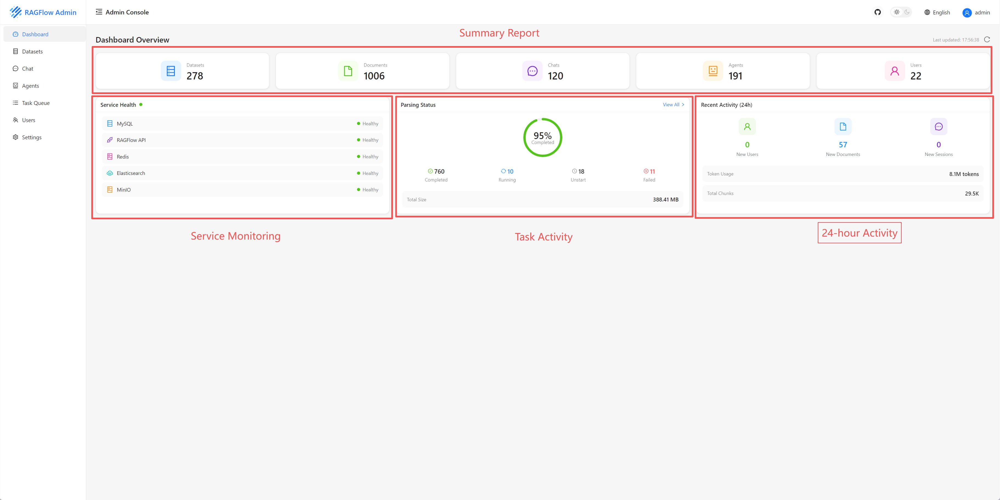
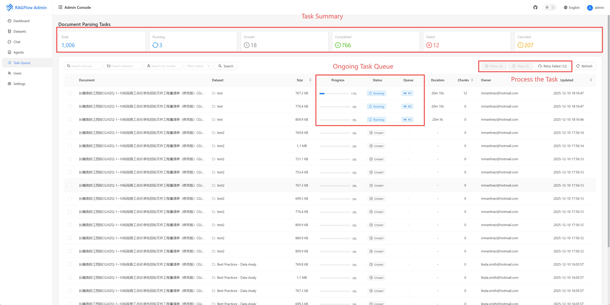
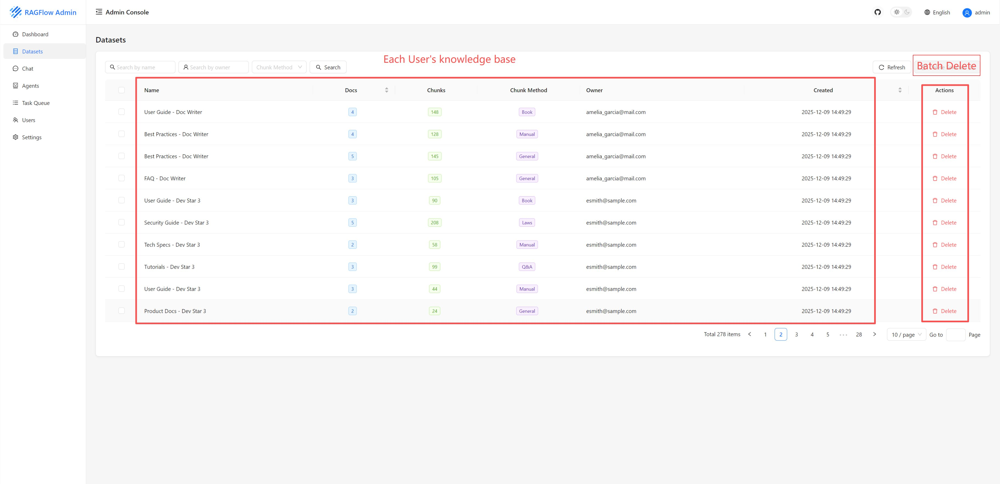
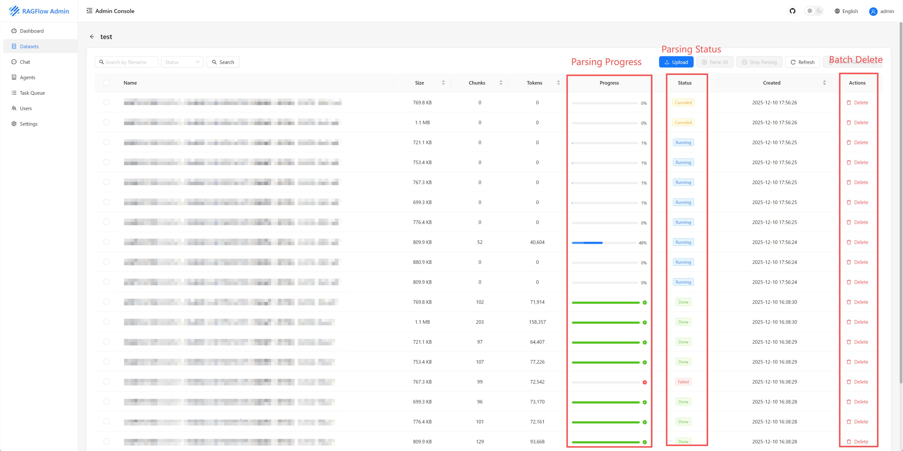
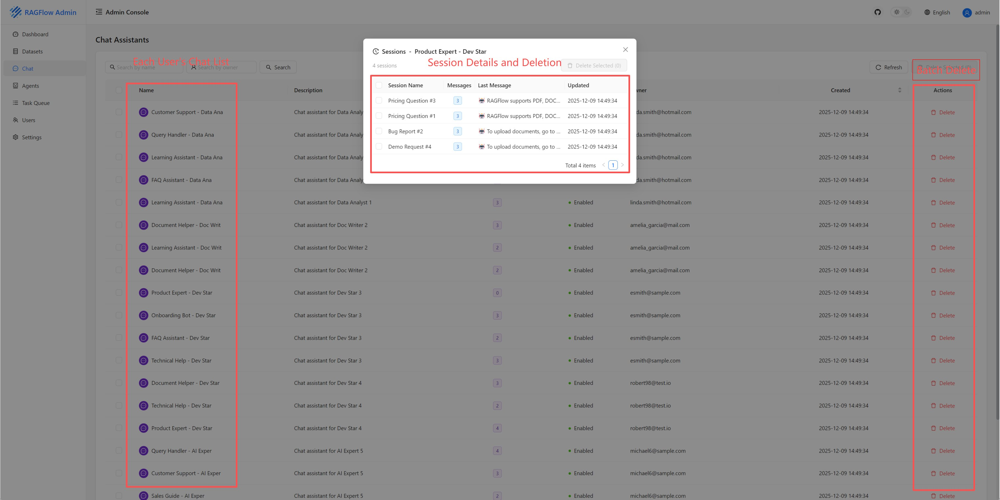
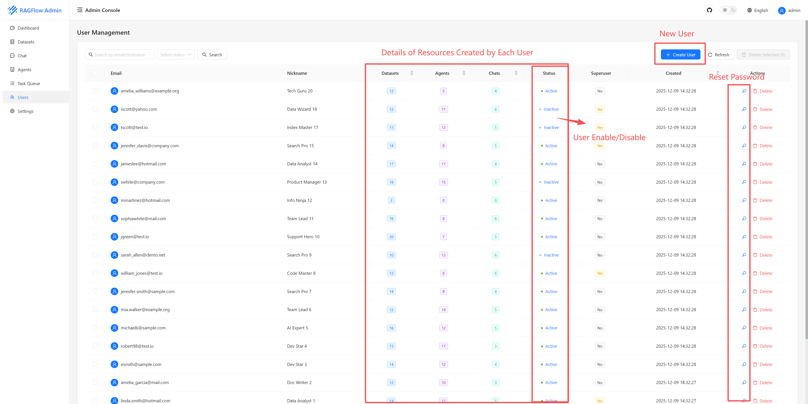
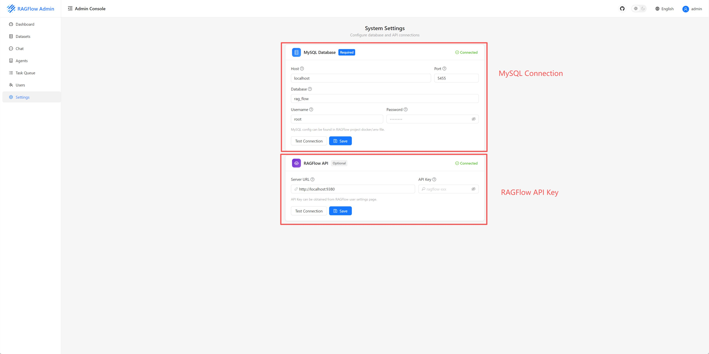

<div align="center">
<a href="https://github.com/infiniflow/ragflow">

</a>
<h1>RAGFlow Admin</h1>
</div>

<p align="center">
  <a href="./README.md">English</a> |
  <a href="./README_zh.md">简体中文</a>
</p>

<p align="center">
    <a href="https://github.com/tedhappy/ragflow-admin/releases/latest">
        
    </a>
    <a href="https://github.com/infiniflow/ragflow">
        
    </a>
    <a href="https://github.com/tedhappy/ragflow-admin/blob/main/LICENSE">
        
    </a>
</p>

<p align="center">
<a href="https://github.com/infiniflow/ragflow">RAGFlow</a> 独立后台管理系统
</p>

---

## 🔎 概述

**RAGFlow Admin** 是一个独立的 RAGFlow 后台管理系统，为 RAGFlow 部署提供现代化的 Web 管理界面。

### 为什么需要 RAGFlow Admin？

RAGFlow 是一款优秀的 RAG 引擎，但在实际使用中存在一些管理上的痛点：

| 痛点 | RAGFlow Admin 解决方案 |
|------|------------------------|
| **无法跨知识库管理** | 提供统一的仪表板，集中管理所有知识库和文档 |
| **批量操作困难** | 支持批量上传、解析、删除文档 |
| **解析任务不透明** | 任务队列实时监控，显示队列位置和进度 |
| **多用户管理复杂** | 统一的用户管理界面，支持多租户 |
| **缺乏运维监控** | 仪表板展示系统健康状态和使用统计 |

## ✨ 功能特性

| 功能 | 描述 |
|------|------|
| **📚 知识库管理** | 创建、删除、批量管理知识库 |
| **📄 文档管理** | 上传、解析、停止、删除文档，实时进度跟踪 |
| **💬 聊天管理** | 查看和管理聊天助手及会话记录 |
| **🤖 智能体管理** | 列表、配置和管理 AI 智能体 |
| **📊 任务队列** | 跨知识库监控解析任务，支持筛选和批量操作 |
| **🔍 系统监控** | 仪表板展示健康检查、统计数据和使用指标 |
| **👥 用户管理** | 查看和管理 RAGFlow 用户（需要 MySQL 访问权限）|
| **🌐 国际化** | 完整的中英文支持 |

## �️ 界面截图

<p align="center">
  
</p>

<p align="center"><em>仪表板 - 系统概览、健康状态和统计数据</em></p>

<p align="center">
  
</p>

<p align="center"><em>任务队列 - 实时文档解析监控</em></p>

### 知识库管理
<p align="center">
  
</p>

### 文档管理
<p align="center">
  
</p>

### 聊天管理
<p align="center">
  
</p>

### 用户管理
<p align="center">
  
</p>

### 系统设置
<p align="center">
  
</p>

## �🚀 快速开始

### 环境要求

- Python 3.10+
- Node.js 18+
- 运行中的 RAGFlow 实例（v0.15+）
- RAGFlow API Key（[如何获取](https://ragflow.io/docs/dev/http_api_reference#create-api-key)）

### 安装步骤

#### 1. 克隆仓库

```bash
git clone https://github.com/tedhappy/ragflow-admin.git
cd ragflow-admin
```

#### 2. 配置

```bash
cp conf/config.example.yaml conf/config.yaml
```

编辑 `conf/config.yaml`，填入你的 RAGFlow 服务地址（也可以在前端设置页面配置）：

```yaml
ragflow:
  base_url: "http://your-ragflow-host:9380"
```

#### 3. 启动后端

```bash
pip install -r requirements.txt
python -m api.server
```

API 服务将启动在 `http://localhost:8080`

#### 4. 启动前端

```bash
cd web
npm install
npm run dev
```

Web 界面访问地址：`http://localhost:8000`

### Docker 部署（即将推出）

```bash
docker-compose up -d
```

## 🏗️ 项目结构

```
ragflow-admin/
├── api/                        # 后端 (Python/Quart)
│   ├── apps/                   # API 路由处理
│   │   ├── dataset_app.py      # 知识库接口
│   │   ├── document_app.py     # 文档接口
│   │   ├── task_app.py         # 任务队列接口
│   │   ├── chat_app.py         # 聊天接口
│   │   ├── agent_app.py        # 智能体接口
│   │   └── ...
│   ├── services/               # 业务逻辑
│   │   ├── ragflow_client.py   # RAGFlow SDK 封装
│   │   └── mysql_client.py     # MySQL 操作
│   └── server.py               # 应用入口
│
├── web/                        # 前端 (React/UmiJS)
│   └── src/
│       ├── pages/              # 页面组件
│       ├── components/         # 可复用 UI 组件
│       ├── services/           # API 客户端
│       ├── hooks/              # 自定义 React Hooks
│       └── locales/            # 国际化翻译 (en/zh)
│
├── conf/                       # 配置文件
│   ├── config.example.yaml     # 配置示例
│   └── config.yaml             # 你的配置（已 gitignore）
│
└── docs/                       # 文档
```

## 🛠️ 技术栈

| 层级 | 技术 |
|------|------|
| **后端** | [Quart](https://quart.palletsprojects.com/)（异步 Python 框架）|
| **RAGFlow 集成** | [ragflow-sdk](https://pypi.org/project/ragflow-sdk/)（官方 Python SDK）|
| **前端** | [React 18](https://react.dev/) + [UmiJS 4](https://umijs.org/) |
| **UI 组件** | [Ant Design 5](https://ant.design/) |
| **样式** | [TailwindCSS 3](https://tailwindcss.com/) |
| **状态管理** | React Query + Zustand |
| **数据库** | MySQL（通过 RAGFlow）|

## 🤝 贡献指南

欢迎贡献代码！请随时提交 Pull Request。

1. Fork 本仓库
2. 创建功能分支（`git checkout -b feature/AmazingFeature`）
3. 提交更改（`git commit -m 'Add some AmazingFeature'`）
4. 推送分支（`git push origin feature/AmazingFeature`）
5. 发起 Pull Request

##  相关链接

- [RAGFlow](https://github.com/infiniflow/ragflow) - 本项目管理的 RAG 引擎
- [RAGFlow 文档](https://ragflow.io/docs/dev/)
- [RAGFlow Python SDK](https://ragflow.io/docs/dev/python_api_reference)
- [RAGFlow HTTP API](https://ragflow.io/docs/dev/http_api_reference)

## 📄 开源协议

本项目采用 [Apache License 2.0](LICENSE) 开源协议。

---

<p align="center">
如果觉得这个项目对你有帮助，请给一个 ⭐️ 支持一下！
</p>
